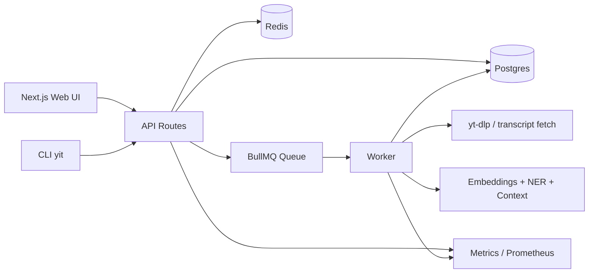

# YouTube Intel Tool

[](LICENSE)
[](https://nodejs.org/)
[](https://pnpm.io/)
[](https://www.typescriptlang.org/)

Turn YouTube videos into a time-indexed research system.

This project ingests a video once, then gives you synced transcript navigation,
semantic search, entity extraction, speaker labeling, grounded chat, and an
operational stack (queues + metrics) you can actually run locally.

## What You Can Do

- Resolve YouTube URLs into canonical video records.
- Ingest transcripts into searchable cues and semantic chunks.
- Click transcript lines to seek video playback.
- Run global or per-video search (`keyword`, `semantic`, `hybrid`).
- Extract named entities and inspect time-aligned mentions.
- Build context cards (Wikipedia + local DB sources).
- Run grounded chat with source references.
- Observe the system with Prometheus-style metrics.

## 2-Minute Quick Start

Prerequisites:

- Node.js `>=20`
- `pnpm` `>=9`
- Docker Desktop (for Postgres + Redis)
- `yt-dlp` (`brew install yt-dlp`)

Boot local:

```bash
pnpm install
pnpm db:up
pnpm db:migrate
pnpm dev
```

Open:

- App: `http://localhost:3333`
- Web metrics: `http://localhost:3333/metrics`
- Worker metrics: `http://localhost:4010/metrics`

First workflow:

1. Paste a YouTube URL on `/` and click `Open`.
2. On the video page, click `Ingest`.
3. Watch live progress in the Job Center.
4. Use `Search`, `Entities`, `Context`, and `Chat` tabs.

## Screenshots

Captured with Playwright CLI. Re-generate anytime via `docs/SCREENSHOTS.md`.

| Home | Video Workspace | Global Search |
| --- | --- | --- |
|  |  |  |

## Use Cases

- Research assistant for long interviews and podcasts
- Team knowledge base for internal video archives
- Speaker/topic tracking across a channel
- Fast QA for "who said what, when" questions

Detailed workflows: [docs/USE_CASES.md](docs/USE_CASES.md)

## Architecture At A Glance



Deep dive: [docs/ARCHITECTURE.md](docs/ARCHITECTURE.md)

## CLI Quick Hits

```bash
# health
pnpm yit health

# resolve URL
pnpm yit resolve "https://www.youtube.com/watch?v=..."

# ingest and stream logs
pnpm yit ingest "https://www.youtube.com/watch?v=..." --wait --logs

# search across full library
pnpm yit search "key claim about retrieval quality"

# grounded chat
pnpm yit chat ask <videoId> "Summarize and cite sources as [S1], [S2]."
```

CLI guide: [docs/CLI.md](docs/CLI.md)

## API Snapshot

- `POST /api/videos/resolve`
- `POST /api/videos/:videoId/ingest`
- `POST /api/search`
- `POST /api/videos/:videoId/search`
- `GET /api/videos/:videoId/transcripts`
- `GET /api/videos/:videoId/entities`
- `GET /api/videos/:videoId/context`
- `POST /api/videos/:videoId/chat`
- `POST /api/videos/:videoId/chat/stream`

API guide: [docs/API.md](docs/API.md)

## Documentation Map

- Start here: [docs/GETTING_STARTED.md](docs/GETTING_STARTED.md)
- Product workflows: [docs/USE_CASES.md](docs/USE_CASES.md)
- System internals: [docs/ARCHITECTURE.md](docs/ARCHITECTURE.md)
- CLI reference: [docs/CLI.md](docs/CLI.md)
- API reference: [docs/API.md](docs/API.md)
- Troubleshooting: [docs/TROUBLESHOOTING.md](docs/TROUBLESHOOTING.md)
- Screenshot pipeline: [docs/SCREENSHOTS.md](docs/SCREENSHOTS.md)
- Security policy: [SECURITY.md](SECURITY.md)
- Contribution guide: [CONTRIBUTING.md](CONTRIBUTING.md)
- Public release checklist: [PUBLIC_REPO_CHECKLIST.md](PUBLIC_REPO_CHECKLIST.md)

## Background / Service Mode

Run stack in the background:

```bash
pnpm bg:up
pnpm bg:status
pnpm bg:logs
pnpm bg:down
```

macOS login service (`launchd`):

```bash
pnpm svc:install
pnpm svc:status
pnpm svc:uninstall
```

## Responsible Use

- Treat full transcript text as potentially copyrighted content.
- Prefer official APIs and proper permissions for production ingestion.
- Do not commit API keys, transcript dumps, or local runtime artifacts.

## Open Source

- License: [MIT](LICENSE)
- Community docs: [CODE_OF_CONDUCT.md](CODE_OF_CONDUCT.md), [CONTRIBUTING.md](CONTRIBUTING.md), [SECURITY.md](SECURITY.md)
- Planned work: [ROADMAP.md](ROADMAP.md)

## Current Publishing Status

This repository is source-first.

- `@yt/sdk`, `@yt/contracts`, and CLI packages are not yet published to npm.
- If you want a public npm release, start with `docs/CLI.md` and `docs/API.md`
  to lock interfaces first.
