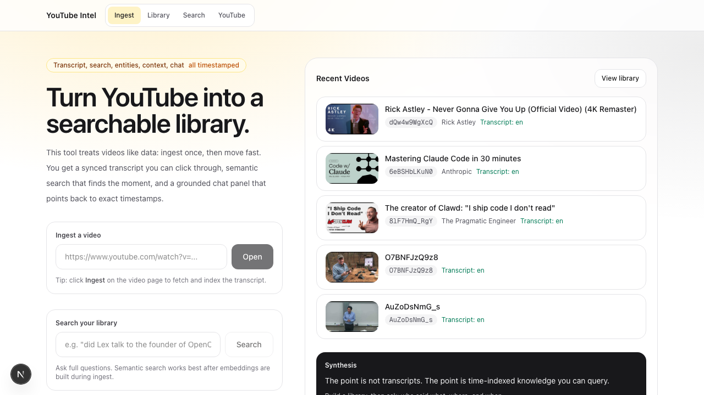
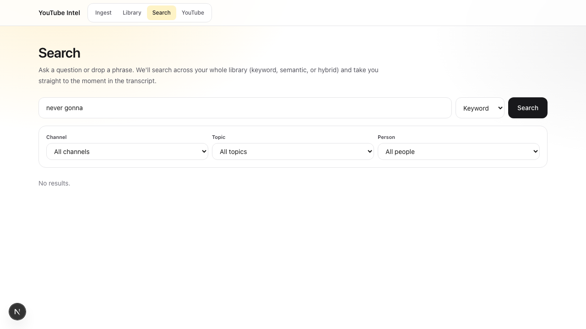
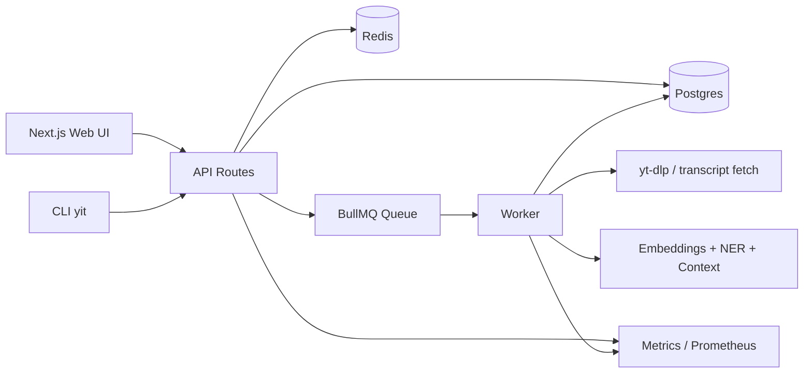

# YouTube Intel Tool

[](LICENSE)
[](https://nodejs.org/)
[](https://pnpm.io/)
[](https://www.typescriptlang.org/)

Turn YouTube videos into a time-indexed research system.

This project ingests a video once, then gives you synced transcript navigation,
semantic search, entity extraction, speaker labeling, grounded chat, and an
operational stack (queues + metrics) you can actually run locally.

## TL;DR

### Human quickstart

```bash
pnpm run setup
pnpm seed:demo   # optional starter ingest list
```

Open `http://localhost:<YIT_WEB_PORT>` (default: `http://localhost:3333`).

Stop everything:

```bash
pnpm bg:down
```

Preflight checks anytime:

```bash
pnpm run doctor
```

### Agentic quickstart

Open Codex, Claude Code, or your preferred agentic CLI in this repo root and
use a prompt like:

```text
Read README.md, docs/GETTING_STARTED.md, and docs/RUNBOOKS.md.
Set up this project locally, verify health, and run the first ingest flow.
```

The scripts and docs are structured so an agent can reliably bring the local
stack up on a machine with prerequisites installed.

Install optional local agent packs:

```bash
pnpm agents:install
```

Browse docs as a structured site (tabs/sections/search):

- https://hopperlabs-opensource.github.io/youtube-intel-tool/

## Local-Only Security Notice

- Intended use: local/self-hosted usage by the person running it.
- Not intended: exposing this app directly to the public internet as-is.
- Why: the default stack is not a hardened multi-tenant internet service.

If exposed publicly without additional hardening, you risk:

- Unauthenticated access to API routes.
- Transcript/chat data exposure.
- API key/header leakage (including browser-provided keys).
- Queue abuse and compute/cost abuse.

If you need internet-facing hosting, add your own authentication, TLS/reverse
proxy, rate limiting, CORS controls, secret management, and monitoring first.

## What You Can Do

- Resolve YouTube URLs into canonical video records.
- Ingest transcripts into searchable cues and semantic chunks.
- Click transcript lines to seek video playback.
- Run global or per-video search (`keyword`, `semantic`, `hybrid`).
- Extract named entities and inspect time-aligned mentions.
- Build context cards (Wikipedia + local DB sources).
- Run grounded chat with source references.
- Observe the system with Prometheus-style metrics.

## 2-Minute Quick Start

Prerequisites:

- Node.js `>=20`
- `pnpm` `>=9`
- Docker Desktop (for Postgres + Redis)
- `yt-dlp` (`brew install yt-dlp`)

Boot local:

```bash
pnpm install
pnpm db:up
pnpm db:migrate
pnpm dev
```

or use one command:

```bash
pnpm run setup
```

Open:

- App: `http://localhost:<YIT_WEB_PORT>` (default `3333`)
- Web metrics: `http://localhost:<YIT_WEB_PORT>/metrics`
- Worker metrics: `http://localhost:<YIT_WORKER_METRICS_PORT>` (default `4010`)

First workflow:

1. Paste a YouTube URL on `/` and click `Open`.
2. On the video page, click `Ingest`.
3. Watch live progress in the Job Center.
4. Use `Search`, `Entities`, `Context`, and `Chat` tabs.

Optional starter content:

```bash
pnpm seed:demo
```

Edit the list in `config/demo_videos.txt`.

## Centralized Config Defaults

Ports and local URL defaults live in `.env.example` and are shared by scripts/runtime:

- `YIT_WEB_PORT`, `YIT_WORKER_METRICS_PORT`
- `YIT_POSTGRES_PORT`, `YIT_REDIS_PORT`
- `YIT_PROMETHEUS_PORT`, `YIT_GRAFANA_PORT`

Advanced overrides remain available in `.env` (`DATABASE_URL`, `REDIS_URL`, `METRICS_PORT`, `YIT_BASE_URL`).

If your local web port is customized, set CLI base URL accordingly:

```bash
export YIT_BASE_URL="http://localhost:${YIT_WEB_PORT:-3333}"
```

## OpenAI Key Sources

- Preferred: set `OPENAI_API_KEY` in local `.env` (server-side).
- Fallback: use the UI `Settings` modal to save a browser-local key.
- Precedence: server `.env` key wins; browser key is only used when `.env` key is missing.
- Risk: browser-saved keys are stored in `localStorage` plaintext for that browser profile.

## Screenshots

Captured with Playwright CLI. Re-generate anytime via `docs/SCREENSHOTS.md`.

| Home | Video Workspace | Global Search |
| --- | --- | --- |
|  |  |  |

## Use Cases

- Research assistant for long interviews and podcasts
- Team knowledge base for internal video archives
- Speaker/topic tracking across a channel
- Fast QA for "who said what, when" questions

Detailed workflows: [docs/USE_CASES.md](docs/USE_CASES.md)

## Architecture At A Glance



Deep dive: [docs/ARCHITECTURE.md](docs/ARCHITECTURE.md)

## CLI Quick Hits

```bash
# health
pnpm yit health
pnpm yit capabilities

# resolve URL
pnpm yit resolve "https://www.youtube.com/watch?v=..."

# ingest and stream logs
pnpm yit ingest "https://www.youtube.com/watch?v=..." --wait --logs

# search across full library
pnpm yit search "key claim about retrieval quality"

# grounded chat
pnpm yit chat ask <videoId> "Summarize and cite sources as [S1], [S2]."
```

CLI guide: [docs/CLI.md](docs/CLI.md)

## API Snapshot

- `POST /api/videos/resolve`
- `POST /api/videos/:videoId/ingest`
- `POST /api/search`
- `POST /api/videos/:videoId/search`
- `GET /api/videos/:videoId/transcripts`
- `GET /api/videos/:videoId/entities`
- `GET /api/videos/:videoId/context`
- `POST /api/videos/:videoId/chat`
- `POST /api/videos/:videoId/chat/stream`

API guide: [docs/API.md](docs/API.md)

## Documentation Map

- Start here: [docs/GETTING_STARTED.md](docs/GETTING_STARTED.md)
- Product workflows: [docs/USE_CASES.md](docs/USE_CASES.md)
- System internals: [docs/ARCHITECTURE.md](docs/ARCHITECTURE.md)
- CLI reference: [docs/CLI.md](docs/CLI.md)
- API reference: [docs/API.md](docs/API.md)
- Governance: [docs/GOVERNANCE.md](docs/GOVERNANCE.md)
- Connect/support channels: [docs/CONNECT.md](docs/CONNECT.md)
- Runbooks (operations): [docs/RUNBOOKS.md](docs/RUNBOOKS.md)
- Configuration model: [docs/CONFIG.md](docs/CONFIG.md)
- Agent packs: [docs/AGENT_PACKS.md](docs/AGENT_PACKS.md)
- Releasing/npm packaging: [docs/RELEASING.md](docs/RELEASING.md)
- Troubleshooting: [docs/TROUBLESHOOTING.md](docs/TROUBLESHOOTING.md)
- Screenshot pipeline: [docs/SCREENSHOTS.md](docs/SCREENSHOTS.md)
- Security policy: [SECURITY.md](SECURITY.md)
- Contribution guide: [CONTRIBUTING.md](CONTRIBUTING.md)
- Public release checklist: [PUBLIC_REPO_CHECKLIST.md](PUBLIC_REPO_CHECKLIST.md)

## Docs Site

- GitHub Pages: `https://hopperlabs-opensource.github.io/youtube-intel-tool/`
- Local preview:
  1. `pnpm docs:requirements`
  2. `pnpm docs:serve`

## Background / Service Mode

Run stack in the background:

```bash
pnpm bg:up
pnpm bg:status
pnpm bg:logs
pnpm bg:down
```

macOS login service (`launchd`):

```bash
pnpm svc:install
pnpm svc:status
pnpm svc:uninstall
```

## Responsible Use

- Treat full transcript text as potentially copyrighted content.
- Prefer official APIs and proper permissions for production ingestion.
- Do not commit API keys, transcript dumps, or local runtime artifacts.

## Open Source

- License: [MIT](LICENSE)
- Community docs: [CODE_OF_CONDUCT.md](CODE_OF_CONDUCT.md), [CONTRIBUTING.md](CONTRIBUTING.md), [SECURITY.md](SECURITY.md)
- Planned work: [ROADMAP.md](ROADMAP.md)

## Support The Project

- GitHub Sponsors: use the `Sponsor` button on this repository.
- Patreon/social channels are not live yet. Track official channel status in
  [docs/CONNECT.md](docs/CONNECT.md).
- When Patreon is ready, enable it in [`.github/FUNDING.yml`](.github/FUNDING.yml) with:
  - `patreon: <official-creator-handle>`

## Governance And Maintainers

- Public contributions use fork + pull request; direct pushes to `main` are blocked.
- Maintainer accounts are required to use 2FA under org security policy.
- See [docs/GOVERNANCE.md](docs/GOVERNANCE.md) for contributor and maintainer access policy.

## Current Publishing Status

This repository is source-first with npm publish scaffolding.

- Publishable packages:
  - `@yt/contracts`
  - `@yt/sdk`
  - `@yt/cli`
- Build and pack dry-run:
  - `pnpm release:check`
- Release playbook:
  - [docs/RELEASING.md](docs/RELEASING.md)
