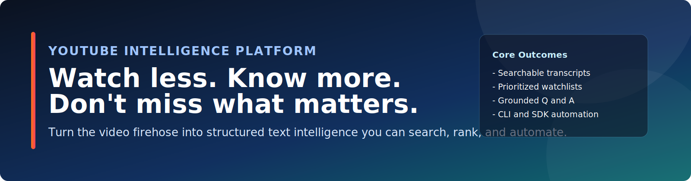
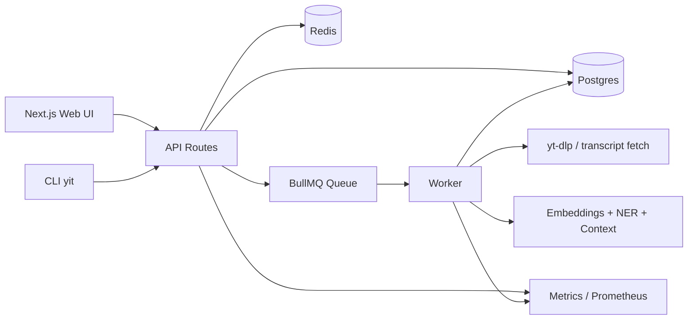

<p align="center">
  
</p>

<p align="center">
  <a href="#quickstart-tldr"><strong>Quickstart</strong></a> ·
  <a href="#product-preview"><strong>Preview</strong></a> ·
  <a href="#documentation-map"><strong>Docs</strong></a> ·
  <a href="#connect-and-support"><strong>Support</strong></a>
</p>

<p align="center">
  <a href="LICENSE"></a>
  <a href="https://nodejs.org/"></a>
  <a href="https://pnpm.io/"></a>
  <a href="https://www.typescriptlang.org/"></a>
</p>

---

## Value Proposition

| Pain | Promise | Outcome |
| --- | --- | --- |
| Content overload + algorithm mismatch + no time. | Turn video firehose into structured text intelligence + priority alerts. | Watch less, know more, and don't miss what matters. |

---

## Product Preview

| Home | Video Workspace | Global Search |
| --- | --- | --- |
|  |  |  |

---

## Personal Algorithm (CLI / SDK / API)

- Define channels, topics, and priorities you care about.
- Run ingestion and ranking policies on schedule (`cron`/CI) via CLI.
- Use SDK/API to generate raw feeds, priority buckets, and alert workflows.
- Refine your rules over time instead of depending on platform default algorithms.

This project ingests a video once, then gives you synced transcript navigation,
semantic search, entity extraction, speaker labeling, grounded chat, and an
operational stack (queues + metrics) you can actually run locally.

---

## Table of Contents

- [Quickstart (TL;DR)](#quickstart-tldr)
- [Value Proposition](#value-proposition)
- [Product Preview](#product-preview)
- [Personal Algorithm (CLI / SDK / API)](#personal-algorithm-cli--sdk--api)
- [Quick Start](#2-minute-quick-start)
- [Local-Only Security Notice](#local-only-security-notice)
- [What You Can Do](#what-you-can-do)
- [Centralized Config Defaults](#centralized-config-defaults)
- [OpenAI Key Sources](#openai-key-sources)
- [Screenshots](#screenshots)
- [Use Cases](#use-cases)
- [Architecture At A Glance](#architecture-at-a-glance)
- [CLI Quick Hits](#cli-quick-hits)
- [API Snapshot](#api-snapshot)
- [Documentation Map](#documentation-map)
- [Docs In Repo](#docs-in-repo)
- [Background / Service Mode](#background--service-mode)
- [Responsible Use](#responsible-use)
- [Open Source](#open-source)
- [Connect and Support](#connect-and-support)
- [Governance And Maintainers](#governance-and-maintainers)
- [Current Publishing Status](#current-publishing-status)

---

## Quickstart (TL;DR)

### Human quickstart

```bash
pnpm run setup
pnpm seed:demo   # optional starter ingest list
```

Open:

- Main app: `http://localhost:<YIT_WEB_PORT>` (default `48333`)
- Karaoke app: `http://localhost:<YIT_KARAOKE_PORT>` (default `48334`, run `pnpm dev:karaoke`)

Stop everything:

```bash
pnpm bg:down
```

Preflight checks anytime:

```bash
pnpm run doctor
```

Validation:

```bash
pnpm test
pnpm test:integration
```

`pnpm test:integration` bootstraps pinned Python deps in `.run/venvs/tests` from `ops/tests/requirements.txt`.

### Agentic quickstart

Open Codex, Claude Code, or your preferred agentic CLI in this repo root and
use a prompt like:

```text
Read README.md, docs/GETTING_STARTED.md, and docs/RUNBOOKS.md.
Set up this project locally, verify health, and run the first ingest flow.
```

The scripts and docs are structured so an agent can reliably bring the local
stack up on a machine with prerequisites installed.

Install optional local agent packs:

```bash
pnpm agents:install
```

Browse docs in this repository:

- [docs/QUICKSTART.md](docs/QUICKSTART.md)
- [docs/GETTING_STARTED.md](docs/GETTING_STARTED.md)
- [docs/RUNBOOKS.md](docs/RUNBOOKS.md)

---

## Local-Only Security Notice

> ⚠️ **Watch out**
> This project is designed for local/self-hosted usage, not direct public internet exposure.

- Intended use: local/self-hosted usage by the person running it.
- Not intended: exposing this app directly to the public internet as-is.
- Why: the default stack is not a hardened multi-tenant internet service.

If exposed publicly without additional hardening, you risk:

- Unauthenticated access to API routes.
- Transcript/chat data exposure.
- API key/header leakage (including browser-provided keys).
- Queue abuse and compute/cost abuse.

If you need internet-facing hosting, add your own authentication, TLS/reverse
proxy, rate limiting, CORS controls, secret management, and monitoring first.

---

## What You Can Do

- Resolve YouTube URLs into canonical video records.
- Ingest transcripts into searchable cues and semantic chunks.
- Click transcript lines to seek video playback.
- Run global or per-video search (`keyword`, `semantic`, `hybrid`).
- Extract named entities and inspect time-aligned mentions.
- Build context cards (Wikipedia + local DB sources).
- Run grounded chat with source references.
- Run local karaoke sessions with queue + beat-scoring from transcript cues.
- Build playlists, bulk-queue sessions from playlists, and moderate guest requests via local join links.
- Observe the system with Prometheus-style metrics.

---

## 2-Minute Quick Start

Prerequisites:

- Node.js `>=20`
- `pnpm` `>=9`
- Docker Desktop (for Postgres + Redis)
- `yt-dlp` (`brew install yt-dlp`)

Boot local:

```bash
pnpm install
pnpm db:up
pnpm db:migrate
pnpm dev
```

or use one command:

```bash
pnpm run setup
```

Open:

- App: `http://localhost:<YIT_WEB_PORT>` (default `48333`)
- Karaoke app: `http://localhost:<YIT_KARAOKE_PORT>` (default `48334`, optional)
- Web metrics: `http://localhost:<YIT_WEB_PORT>/metrics`
- Worker metrics: `http://localhost:<YIT_WORKER_METRICS_PORT>` (default `48410`)

First workflow:

1. Paste a YouTube URL on `/` and click `Open`.
2. On the video page, click `Ingest`.
3. Watch live progress in the Job Center.
4. Use `Search`, `Entities`, `Context`, and `Chat` tabs.

Optional starter content:

```bash
pnpm seed:demo
```

Edit the list in `config/demo_videos.txt`.

---

## Centralized Config Defaults

Ports and local URL defaults live in `.env.example` and are shared by scripts/runtime:

- `YIT_WEB_PORT`, `YIT_KARAOKE_PORT`, `YIT_WORKER_METRICS_PORT`
- `YIT_POSTGRES_PORT`, `YIT_REDIS_PORT`
- `YIT_PROMETHEUS_PORT`, `YIT_GRAFANA_PORT`

Advanced overrides remain available in `.env` (`DATABASE_URL`, `REDIS_URL`, `METRICS_PORT`, `YIT_BASE_URL`).

If your local web port is customized, set CLI base URL accordingly:

```bash
export YIT_BASE_URL="http://localhost:${YIT_WEB_PORT:-48333}"
```

---

## OpenAI Key Sources

- Preferred: set `OPENAI_API_KEY` in local `.env` (server-side).
- Fallback: use the UI `Settings` modal to save a browser-local key.
- Precedence: server `.env` key wins; browser key is only used when `.env` key is missing.
- Risk: browser-saved keys are stored in `localStorage` plaintext for that browser profile.

---

## Screenshots

Captured with Playwright CLI. Re-generate anytime via `docs/SCREENSHOTS.md`.

| Home | Video Workspace | Global Search |
| --- | --- | --- |
|  |  |  |

---

## Use Cases

- Research assistant for long interviews and podcasts
- Team knowledge base for internal video archives
- Speaker/topic tracking across a channel
- Fast QA for "who said what, when" questions

Detailed workflows: [docs/USE_CASES.md](docs/USE_CASES.md)

---

## Architecture At A Glance



Deep dive: [docs/ARCHITECTURE.md](docs/ARCHITECTURE.md)

---

## CLI Quick Hits

```bash
# health
pnpm yit health
pnpm yit capabilities

# resolve URL
pnpm yit resolve "https://www.youtube.com/watch?v=..."

# ingest and stream logs
pnpm yit ingest "https://www.youtube.com/watch?v=..." --wait --logs

# search across full library
pnpm yit search "key claim about retrieval quality"

# save and run a policy
pnpm yit policy create --name "daily-rag" --query "retrieval quality" --mode hybrid
pnpm yit policy run <policyId> --triggered-by cli
pnpm yit feed url <policyId>

# grounded chat
pnpm yit chat ask <videoId> "Summarize and cite sources as [S1], [S2]."

# karaoke flow
pnpm yit karaoke track add --url "https://www.youtube.com/watch?v=dQw4w9WgXcQ"
pnpm yit karaoke session create --name "Friday Night" --theme gold-stage
pnpm yit karaoke queue add --session <sessionId> --track <trackId> --player Host
pnpm yit karaoke playlist create --name "Warmup Set"
pnpm yit karaoke guest token --session <sessionId>
pnpm yit karaoke leaderboard --session <sessionId>

# manifest-driven karaoke library
pnpm yit karaoke library manifest-init --file manifests/karaoke/library.local.json
pnpm yit karaoke library manifest-validate --file manifests/karaoke/library.local.json
pnpm yit karaoke library manifest-import --file manifests/karaoke/library.local.json
pnpm yit karaoke library stats
```

CLI guide: [docs/CLI.md](docs/CLI.md)

---

## API Snapshot

- `POST /api/videos/resolve`
- `POST /api/videos/:videoId/ingest`
- `POST /api/search`
- `POST /api/videos/:videoId/search`
- `GET /api/videos/:videoId/transcripts`
- `GET /api/videos/:videoId/entities`
- `GET /api/videos/:videoId/context`
- `POST /api/videos/:videoId/chat`
- `POST /api/videos/:videoId/chat/stream`
- `GET /api/policies`
- `POST /api/policies`
- `POST /api/policies/:policyId/run`
- `GET /api/feeds/:policyId.json?token=...`
- `GET /api/feeds/:policyId.rss?token=...`
- `GET /api/karaoke/tracks`
- `POST /api/karaoke/sessions`
- `POST /api/karaoke/sessions/:sessionId/queue`
- `POST /api/karaoke/sessions/:sessionId/scores/events`
- `GET|POST /api/karaoke/playlists`
- `POST /api/karaoke/sessions/:sessionId/guest-token`
- `POST /api/karaoke/library/import`
- `GET /api/karaoke/library/stats`

API guide: [docs/API.md](docs/API.md)

---

## Documentation Map

- Quick Start: [docs/QUICKSTART.md](docs/QUICKSTART.md)
- Start here: [docs/GETTING_STARTED.md](docs/GETTING_STARTED.md)
- Product workflows: [docs/USE_CASES.md](docs/USE_CASES.md)
- Karaoke workflow: [docs/KARAOKE.md](docs/KARAOKE.md)
- System internals: [docs/ARCHITECTURE.md](docs/ARCHITECTURE.md)
- CLI reference: [docs/CLI.md](docs/CLI.md)
- API reference: [docs/API.md](docs/API.md)
- Governance: [docs/GOVERNANCE.md](docs/GOVERNANCE.md)
- Runbooks (operations): [docs/RUNBOOKS.md](docs/RUNBOOKS.md)
- Configuration model: [docs/CONFIG.md](docs/CONFIG.md)
- Agent packs: [docs/AGENT_PACKS.md](docs/AGENT_PACKS.md)
- Competitor patterns to port: [docs/COMPETITOR_PATTERNS.md](docs/COMPETITOR_PATTERNS.md)
- Releasing/npm packaging: [docs/RELEASING.md](docs/RELEASING.md)
- GitHub docs style guide: [docs/github_docs_styleguide.md](docs/github_docs_styleguide.md)
- Troubleshooting: [docs/TROUBLESHOOTING.md](docs/TROUBLESHOOTING.md)
- Screenshot pipeline: [docs/SCREENSHOTS.md](docs/SCREENSHOTS.md)
- Security policy: [SECURITY.md](SECURITY.md)
- Contribution guide: [CONTRIBUTING.md](CONTRIBUTING.md)
- Public release checklist: [PUBLIC_REPO_CHECKLIST.md](PUBLIC_REPO_CHECKLIST.md)

---

## Docs In Repo

- Main docs folder: [`docs/`](docs)
- Start at (repo index): [docs/README.md](docs/README.md)
- Start at (docs site home): [docs/index.md](docs/index.md)

---

## Background / Service Mode

Run stack in the background:

```bash
pnpm bg:up
pnpm bg:status
pnpm bg:logs
pnpm bg:logs karaoke
pnpm bg:down
```

macOS login service (`launchd`):

```bash
pnpm svc:install
pnpm svc:status
pnpm svc:uninstall
```

---

## Responsible Use

- Treat full transcript text as potentially copyrighted content.
- Prefer official APIs and proper permissions for production ingestion.
- Do not commit API keys, transcript dumps, or local runtime artifacts.

---

## Open Source

- License: [MIT](LICENSE)
- Community docs: [CODE_OF_CONDUCT.md](CODE_OF_CONDUCT.md), [CONTRIBUTING.md](CONTRIBUTING.md), [SECURITY.md](SECURITY.md)
- Planned work: [ROADMAP.md](ROADMAP.md)

---

## Connect and Support

<p>
  <a href="https://github.com/sponsors/Unclip1843"></a>
  <a href="https://github.com/hopperlabs-opensource/youtube-intel-tool/discussions"></a>
  <a href="https://github.com/hopperlabs-opensource/youtube-intel-tool/issues"></a>
  <a href="#connect-and-support"></a>
  <a href="#connect-and-support"></a>
  <a href="#connect-and-support"></a>
</p>

| Channel | Status | Link |
| --- | --- | --- |
| <a href="https://github.com/sponsors/Unclip1843"></a> GitHub Sponsors | Live | [github.com/sponsors/Unclip1843](https://github.com/sponsors/Unclip1843) |
| <a href="https://github.com/hopperlabs-opensource/youtube-intel-tool/discussions"></a> GitHub Discussions | Live | [github.com/hopperlabs-opensource/youtube-intel-tool/discussions](https://github.com/hopperlabs-opensource/youtube-intel-tool/discussions) |
| <a href="https://github.com/hopperlabs-opensource/youtube-intel-tool/issues"></a> GitHub Issues | Live | [github.com/hopperlabs-opensource/youtube-intel-tool/issues](https://github.com/hopperlabs-opensource/youtube-intel-tool/issues) |
|  Patreon | Coming soon | Will be published here once active |
|  X | Coming soon | Will be published here once active |
|  YouTube | Coming soon | Will be published here once active |

- Use GitHub Sponsors for direct support today.
- Use Discussions for maintainer and community requests.
- Keep Patreon disabled in [`.github/FUNDING.yml`](.github/FUNDING.yml) until the official handle exists.

---

## Governance And Maintainers

- Public contributions use fork + pull request; protected `main` requires PRs, required checks, and 1 approval.
- Maintainer accounts are required to use 2FA under org security policy.
- See [docs/GOVERNANCE.md](docs/GOVERNANCE.md) for contributor and maintainer access policy.

---

## Current Publishing Status

This repository is source-first with npm publish scaffolding.

- Publishable packages:
  - `@yt/contracts`
  - `@yt/sdk`
  - `@yt/cli`
- Build and pack dry-run:
  - `pnpm release:check`
- Release playbook:
  - [docs/RELEASING.md](docs/RELEASING.md)
