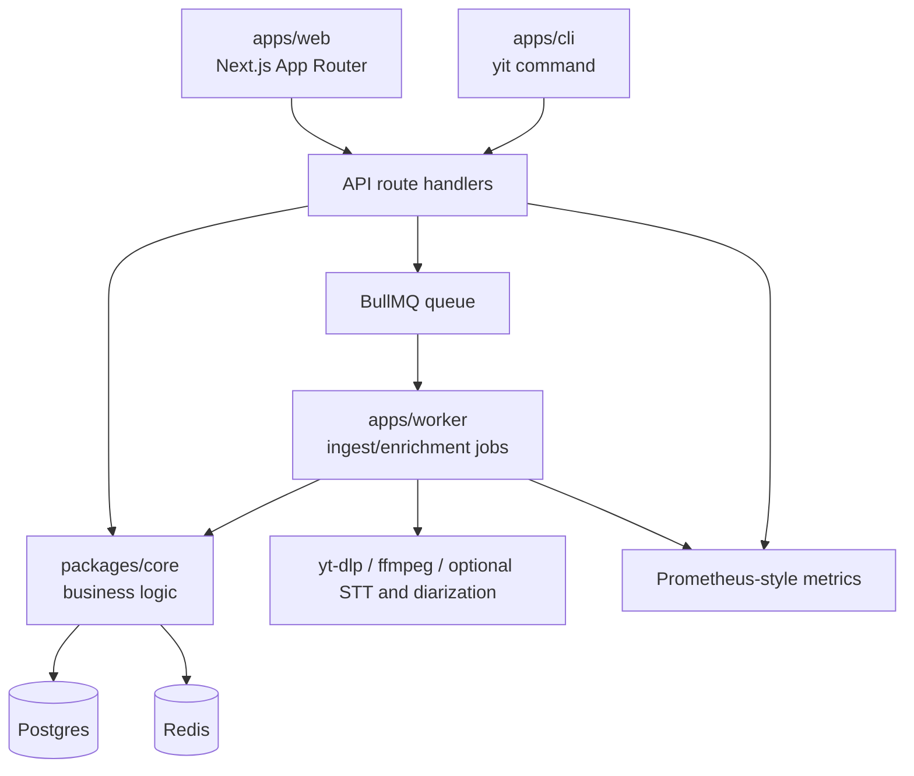

# Architecture
Owner: Maintainers
Status: Stable
Last updated: 2026-02-28

## TL;DR
- Monorepo with `apps/web`, `apps/worker`, `apps/cli`, `packages/core`, `packages/contracts`, and `packages/sdk`.
- API boundaries are contract-first (Zod) and shared across UI/CLI/SDK/tests.
- Worker-driven ingest/enrichment feeds searchable transcript and chat workflows.

This repository is a TypeScript monorepo with a web app, worker, shared core, shared contracts, and SDK tests.

## Component Overview



## Request Paths

### Video Resolve

1. Client posts YouTube URL to `POST /api/videos/resolve`.
2. URL is normalized to `provider_video_id`.
3. Video record is upserted.
4. Best-effort metadata enrichment runs via oEmbed.
5. Canonical video JSON is returned.

### Ingest Job

1. Client posts to `POST /api/videos/:videoId/ingest`.
2. API enqueues BullMQ job.
3. Worker fetches transcript and builds chunks.
4. Optional enrichment runs (embeddings, entities, context, diarization).
5. Job status and logs stream over SSE.

### Search

1. Client posts query to `/api/search` or `/api/videos/:videoId/search`.
2. Keyword mode uses cue-level text retrieval.
3. Semantic mode uses embedding retrieval if provider is configured.
4. Hybrid mode merges scores by cue identity.
5. Response returns ranked hits with snippets and timestamps.

### Chat

1. Client posts turns to `/api/videos/:videoId/chat` or `/chat/stream`.
2. Retrieval pipeline gathers cues/chunks/context scoped to video.
3. Provider (CLI/mock/Ollama) generates response.
4. Turn provenance is persisted for inspectability.

## Data Domains

Primary entities:

- `videos`
- `transcripts`
- `transcript_cues`
- `jobs` + `job_logs`
- `entities` + `entity_mentions`
- `context_items`
- `video_speakers` + `speaker_segments`
- `chat_turns`

Schema migrations live in `packages/core/migrations`.

## Contracts and Type Safety

- Request/response schemas live in `packages/contracts` (Zod).
- Route handlers validate inputs and outputs against contracts.
- Web UI calls API through `apps/web/lib/api_client.ts` (SDK wrapper), not ad-hoc fetches.
- Route coverage parity is enforced by `packages/sdk/test/routes-parity.test.ts`.
- SDK contract tests run against a live stack via `pnpm test:integration` (or `pnpm test:contract` with a pre-running stack).

## Web State Model

- Server data fetching/caching: React Query.
- Client-only UI state: Zustand (`apps/web/lib/jobs_store.ts`) for job dock/inspector persistence.
- This keeps UI state concerns decoupled from transport and API contract logic.

## Observability

- Web metrics endpoint: `/metrics`
- Worker metrics endpoint: `:48410/metrics` by default
- Optional local Prometheus/Grafana stack:

```bash
pnpm obs:up
pnpm obs:down
```

## Operational Modes

- Foreground dev: `pnpm dev`
- Background mode: `pnpm bg:up`
- macOS login service: `pnpm svc:install`

## Design Principles

- Keep ingest deterministic and restart-safe.
- Keep contracts explicit at API boundaries.
- Keep provenance inspectable for search/chat results.
- Keep provider integrations pluggable and optional.
