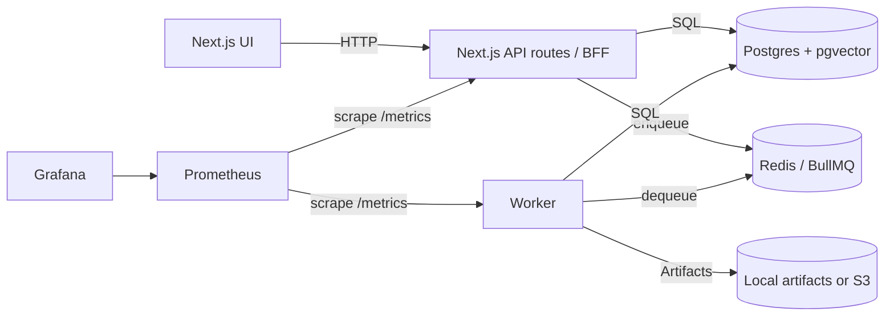
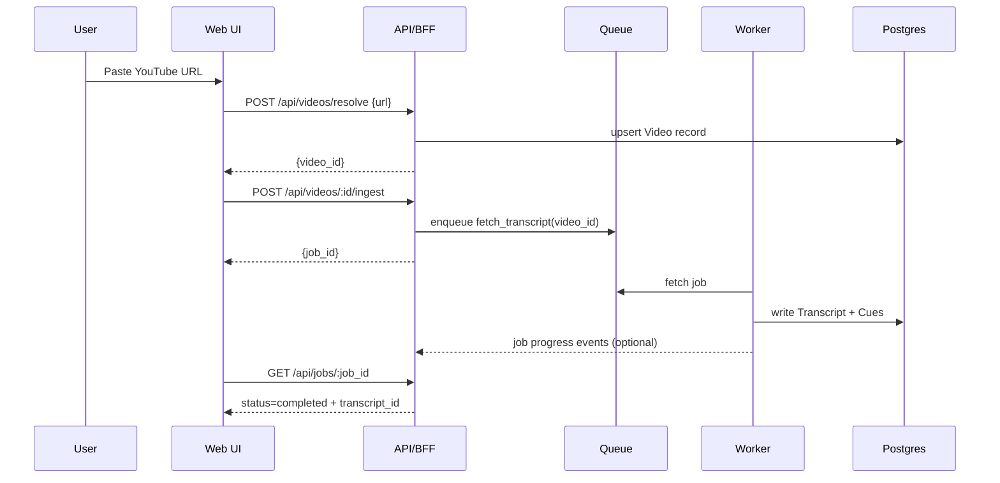

# 01 - System Architecture

## High-Level Components
- **Web App (UI + BFF API)**: Next.js app that serves UI and hosts “API routes” (or a separate API service).
- **Worker(s)**: BullMQ workers processing ingestion and enrichment jobs.
- **Postgres (pgvector)**: canonical storage + FTS + vector search.
- **Redis**: BullMQ queues, rate limiting, SSE session state if needed.
- **Artifacts Store**: local disk for dev; optional S3-compatible storage later.
- **Observability Stack**: Prometheus scrape + Grafana dashboards.

## Reference Topology

## Key Flows

### 1) Ingest Video (URL -> transcript)

### 2) Playback Sync (video time -> active cue)
UI polls `player.currentTime` and:
- Converts seconds -> `at_ms`.
- Finds current cue via binary search on `cues[i].start_ms`.
- Highlights that cue; optionally auto-scroll.

### 3) Search -> Jump
- Keyword search uses Postgres FTS on `norm_text`.
- Semantic search uses pgvector over chunk embeddings.
- Results return `cue_id` + `start_ms`, so UI can seek and scroll.

## Technology Choices (Recommended)
- UI: Next.js (App Router), React, Tailwind, TanStack Query.
- State: Zustand for UI state (panels, follow-mode, selection).
- API contracts: Zod (request/response).
- Worker: BullMQ.
- DB: Postgres + pgvector + FTS.
- Embeddings:
  - Local: Ollama embedding model (`nomic-embed-text`) if available.
  - Hosted: OpenAI/Anthropic embeddings as optional.
- NER:
  - Deterministic: spaCy (Python worker) for speed.
  - Optional: LLM-based for improved entity linking.

## Core Interfaces (Pluggable Providers)

### TranscriptProvider
- `fetchTranscript({provider_video_id, language}) -> TranscriptCue[]`
- returns cue `text`, `start_ms`, `duration_ms` (or end_ms).

### EmbeddingProvider
- `embed({texts[]}) -> vectors[]`
- tracks: model_id, dimensions, cost, latency.

### NerProvider
- `extract({text, cues}) -> Entities + Mentions`
- must map mentions back to cue/time. (Use per-cue NER first, then merge entities.)

### ContextProvider
- `lookup(entity) -> ContextItem[]`
- Wikipedia provider, plus “Your DB” provider(s).

